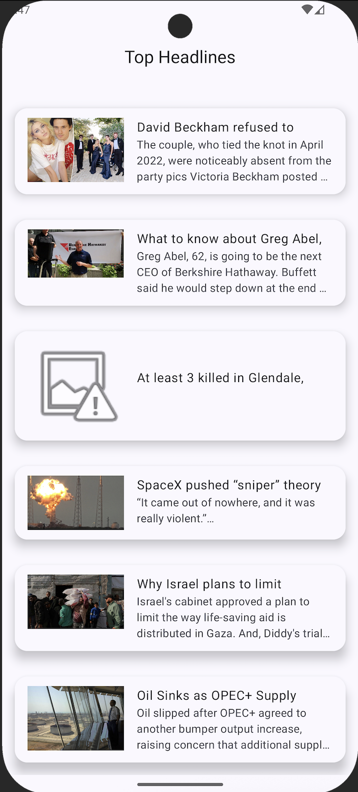
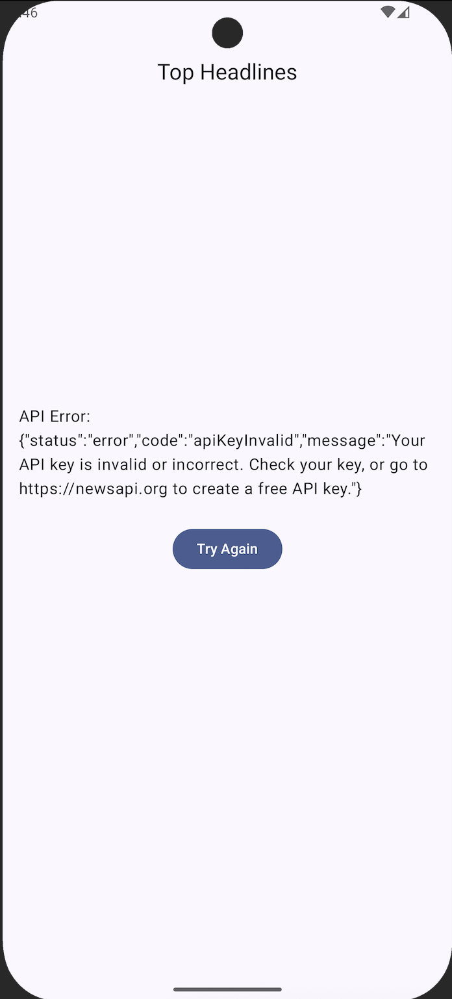

# News Android App

## Getting Started

Check out the project

```
git clone https://github.com/sumitbhondave/Android-NewsApp-MVI-CleanArchitecture.git
```

This is a simple News app build with Jetpack Compose, MVI, Clean Architecture, Hilt, Retrofit,
Coroutines, Flow, Coil, etc.

## Screenshots

| Home                                          |
|-----------------------------------------------|
| []    |
|                                               |
| [] |

## Features

- List of Top HeadLines

## Libraries

- Jetpack Compose
- Jetpack Navigation
- Hilt
- Retrofit
- Coroutines
- Flow
- Coil

## Architecture

- Multi Modular Architecture
- Clean Architecture
- MVI
- Repository pattern
- UseCases

## Modules

- app
- core
    - common
    - navigation
    - network
- data
- domain
- presentation
    - newslist
    - newsdetails

## How to run

- Clone the project
- To begin using the News API, generate your API key from https://newsapi.org. and add API_KEY in
  `local.properties` file
- Run the app
